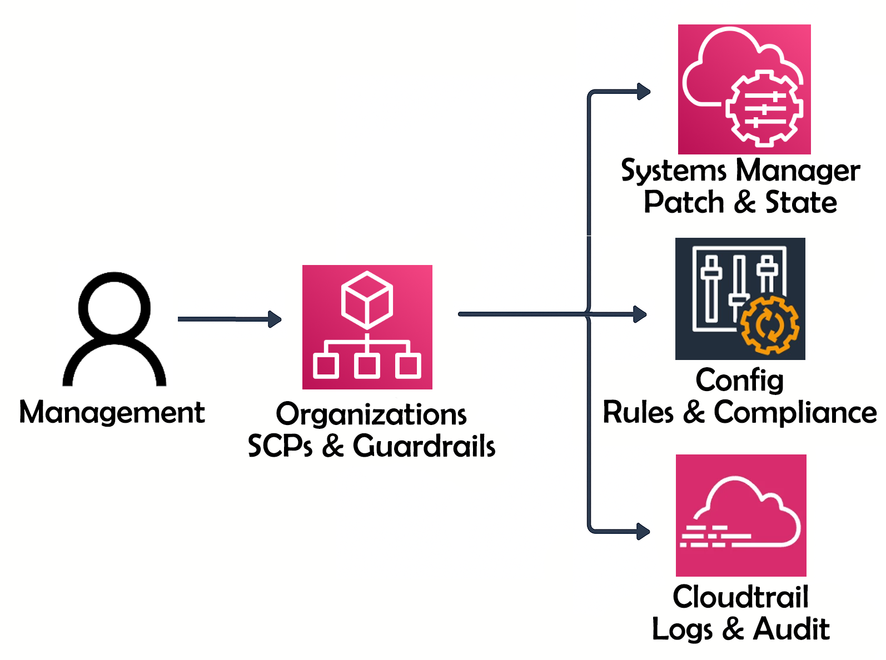

# AWS CSS - Domain 6 - Management & Security Governance

Built a governance framework using **AWS Organizations, Config, Service Control Policies (SCPs), Systems Manager and CloudTrail** to enforce compliance and audit changes across accounts.  

**Why it matters:** Security governance in AWS ensures that policies are consistently applied, compliance is enforced and risky actions are prevented at scale. This lab demonstrates both preventive and detective controls in action.

---

## Table of Contents

- [Overview](#overview)  
- [Objectives](#objectives)  
- [Diagram](#diagram)  
- [Steps Performed](#steps-performed)  
  - [1. AWS Organizations Setup]  
  - [2. AWS Config Enablement & Rules]  
  - [3. Service Control Policies (SCPs)]  
  - [4. Systems Manager Compliance Enforcement]  
  - [5. CloudTrail for Auditing & Change Detection]  
  - [6. Cleanup]  
- [Screenshots](#screenshots)  
- [Lessons Learned](#lessons-learned)  
- [References](#references)  
- [Contact](#contact)  

---

## Overview

Governance in AWS combines multiple services to provide layered controls:  
- **Organizations** to centralize account management.  
- **Config** to track compliance with rules.  
- **SCPs** to block destructive actions across accounts.  
- **Systems Manager** to enforce secure baselines at the server level.  
- **CloudTrail** to log all changes for full accountability.  

---

## Objectives

- Build a **multi-account structure** (Dev, Prod, Audit) with AWS Organizations.  
- Enable **AWS Config** organization-wide and enforce compliance rules.  
- Apply **Service Control Policies** to restrict high-risk actions.  
- Use **Systems Manager State Manager** to enforce patching and security baselines.  
- Enable **CloudTrail** org-wide to audit IAM and resource changes.  

---

## Diagram 

---

## Steps Performed

- **1. AWS Organizations Setup**  
   - Created Organization with `Dev`, `Prod` and `Audit` accounts.  
   - Verified org tree and root account *(Screenshot: `org_tree_view.png`)*.  

- **2. AWS Config Enablement & Rules**  
   - Configured delivery channel *(Screenshots: `config_delivery_channel.png` & `config_delivery_channel_set.png`)*.  
   - Enabled recording for resources *(Screenshot: `config_recording_on.png`)*.  
   - Created rules for compliance monitoring *(Screenshot: `config_rules_created.png`)*.  
   - Validated noncompliant findings *(Screenshot: `config_noncompliant_logging.png`)*.  

- **3. Service Control Policies (SCPs)**  
   - Created custom SCP to deny S3 bucket deletions *(Screenshot: `scp_created.png`)*.  
   - Attached SCP to root and Dev OU *(Screenshot: `scp_attached.png`)*.  
   - Verified enforcement: delete denied in Dev *(Screenshots: `scp_dev_bucket_created.png` & `scp_delete_denied.png`)*.  

- **4. Systems Manager Compliance Enforcement**  
   - Created IAM role with `AmazonSSMManagedInstanceCore` and attached to EC2 *(Screenshots: `iam_role_created.png`, `iam_role_attached.png` & `ec2_patchgroup_tagged.png`)*.  
   - Registered EC2 as managed instance *(Screenshot: `ssm_managed_instance.png`)*.  
   - Applied patch baseline via State Manager *(Screenshots: `patch_baseline_details.png`, `patch_baseline_rule.png` & `ssm_state_manager.png`)*.  
   - Verified compliance reporting *(Screenshots: `patch_scan_devlinux.png` & `patch_compliance_report.png`)*.  

- **5. CloudTrail for Auditing & Change Detection**  
   - Created org-wide trail `OrgTrail-Domain6` *(Screenshot: `org_trail_created.png`)*.  
   - Verified event history captured *(Screenshot: `event_history_initial.png`)*.  
   - Edited IAM policy (test) *(Screenshot: `iam_policy_change.png`)*.  
   - Verified policy change logged in CloudTrail *(Screenshot: `event_history_policychange.png`)*.  

- **6. Cleanup**  
   - Deleted lab EC2 instances and associated IAM roles/policies.  
   - Stopped and deleted Config recorder and delivery channel.  
   - Removed test S3 buckets and SCPs.  
   - Deleted CloudTrail test trail.  

---

## Screenshots

*All screenshots are included in the `screenshots/` folder.*

| Step | Filename                          | Description                                           |
| ---- | --------------------------------- | ----------------------------------------------------- |
| 1    | org_tree_view.png                 | Organization with Dev, Prod, Audit accounts           |
| 2    | config_delivery_channel.png       | Config delivery channel creation                      |
| 2    | config_delivery_channel_set.png   | Delivery channel linked to S3                         |
| 2    | config_recording_on.png           | Config recorder enabled                               |
| 2    | config_rules_created.png          | Compliance rules created in Config                    |
| 2    | config_noncompliant_logging.png   | Noncompliant resources flagged by Config              |
| 3    | scp_created.png                   | SCP created to deny S3 bucket deletion                |
| 3    | scp_attached.png                  | SCP attached to Org root                              |
| 3    | scp_dev_bucket_created.png        | Test S3 bucket created in Dev                         |
| 3    | scp_delete_denied.png             | Delete bucket denied by SCP                           |
| 4    | iam_role_created.png              | IAM role created for SSM                              |
| 4    | iam_role_attached.png             | IAM role attached to EC2                              |
| 4    | ec2_patchgroup_tagged.png         | EC2 instance tagged for patch group                   |
| 4    | ssm_managed_instance.png          | EC2 registered as managed instance                    |
| 4    | patch_baseline_details.png        | Patch baseline details in Patch Manager               |
| 4    | patch_baseline_rule.png           | Patch rules applied to EC2                            |
| 4    | ssm_state_manager.png             | State Manager association created                     |
| 4    | patch_scan_devlinux.png           | Patch compliance scan run on instance                 |
| 4    | patch_compliance_report.png       | Compliance report showing EC2 status                  |
| 5    | org_trail_created.png             | Org-wide CloudTrail created                           |
| 5    | event_history_initial.png         | Event history showing CloudTrail activity             |
| 5    | iam_policy_change.png             | Test IAM policy modified                              |
| 5    | event_history_policychange.png    | CloudTrail log of IAM policy change                   |

---

## Lessons Learned

- **Organizations scale control**: SCPs prevent destructive actions across accounts.  
- **Config enforces compliance**: Detects and reports misconfigurations continuously.  
- **Systems Manager adds depth**: Extends governance to patch and security baselines on EC2.  
- **CloudTrail provides evidence**: Full visibility into IAM and resource changes.  
- **Governance is layered**: Preventive (SCPs), detective (Config) and corrective (SSM).  

---

## References

- [AWS Organizations](https://docs.aws.amazon.com/organizations/latest/userguide/orgs_introduction.html)  
- [AWS Config](https://docs.aws.amazon.com/config/latest/developerguide/WhatIsConfig.html)  
- [Service Control Policies](https://docs.aws.amazon.com/organizations/latest/userguide/orgs_manage_policies_scps.html)  
- [AWS Systems Manager](https://docs.aws.amazon.com/systems-manager/latest/userguide/what-is-systems-manager.html)  
- [AWS CloudTrail](https://docs.aws.amazon.com/awscloudtrail/latest/userguide/cloudtrail-user-guide.html)  

---

## Contact

Sebastian Silva C. – September 2025 – Berlin, Germany.  
- [LinkedIn](https://www.linkedin.com/in/sebastiansilc/)  
- [GitHub](https://github.com/SebaSilC)  
- [sebastian@playbookvisualarts.com](mailto:sebastian@playbookvisualarts.com)  
